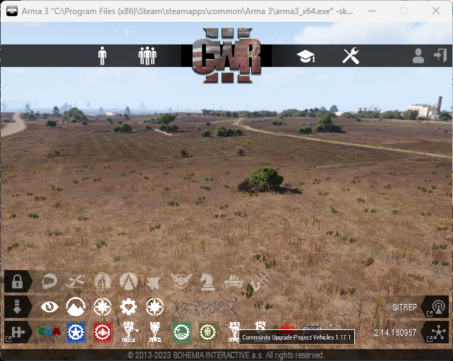
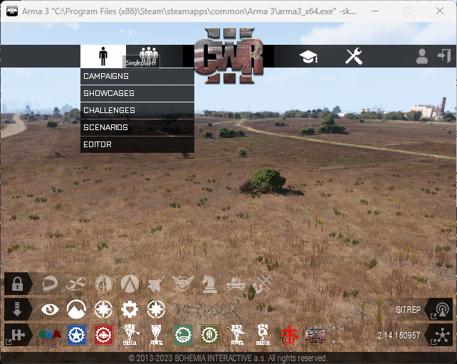

# Basic Knowledge about `Arma 3` and the `EDEN Editor`


* This document explains the knowledge required to understand, use, and improve the `G-MAD` tool.

* Most of the content in this document is available on the official Arma 3 online community wiki, but since the documentation is extensive, only the necessary parts are included here.

* If you would like to learn more than what is covered in this document, please refer to the [Arma 3 Online Community Wiki](https://community.bistudio.com/wiki/Category:Arma_3:_Scripting_Commands).

* If you find any errors in this document or would like to add more content, please feel free to contact us.


## 0. Preparation Required for Using `G-MAD`

* You must place the basic `parameter.txt` file in `C:/Users/{username}/Documents/Arma 3`.

* Move the `missions` folder included in the code to `C:/Users/{username}/Documents/Arma 3/missions`.

  - Please note that while the code is running, you must not open or modify any files that the code is using or generating.

---

## 1. A Brief Introduction to the Arma 3 Game and Important Notes

Arma 3 allows users to create a wide variety of missions using the features of the EDEN Editor and scripts. Arma 3 players can create their own missions through the Editor and distribute them using the export feature.

The image below is the main screen of Arma 3. It may look slightly different depending on which mods and settings are applied.

<p align="center">
    
</p>

If you place the mouse cursor over the spot where the character is shown on that screen, the following screen appears.

<p align="center">
    
</p>

From this screen, you can create and debug the mission you want using `EDITOR`, and then run it through `SCENARIO` to obtain the dataset you want.

> ⚠️ You must clearly distinguish between `EDITOR` and `SCENARIO`. The files used bWWy `EDITOR` are located in the document folder (`Documents\Arma 3`), whereas the folders used by `SCENARIO` are located under the Steam installation path in the Arma 3 folder (`C:\Program Files (x86)\Steam\steamapps\common\Arma 3`). There can be multiple `EDITOR` folders depending on the user profile, but there is only one folder used by `SCENARIO`.

> ⚠️ The mission folder name handled in `EDITOR` is `mission`, while the mission folder name handled in `SCENARIO` is `Mission` (the first letter differs in lowercase/uppercase).

> ⚠️ If a Scenario is run with the default profile, screenshots are saved in `Documents\Arma 3\Screenshots`. However, if it is run with another profile, screenshots are saved in `Documents\Arma 3 - Other Profiles\{ProfileName}\Screenshots`.

> ⚠️ The reason for distinguishing these two is because of errors. If you run a Scenario created through the `EDEN Editor`, all errors are displayed, so mission creation may stop because of non-critical errors. However, if you export the created Scenario and then run it through `Scenarios`, errors are not printed during actual gameplay, so scene generation will not stop because of those errors. In addition, under `Scenarios`, you can use mods to ignore various warnings.

---

## 2. The Workflow of `G-MAD` and What Is Required

At a high level, `G-MAD` works as follows:

1. It receives the information the user wants (camera type, time of day, map, weather, image size, sampling rate, etc.).

2. It creates a mission based on the user’s input.

3. It moves the created mission under the Steam folder and runs it through `Play Scenario`.

4. As Arma 3 runs, Python reads the generated scenario files from the folder and organizes them.

5. Once data generation is complete, it cleans up the dummy files.

Among these steps, the stages that require knowledge of the Arma 3 game itself rather than the SQF language are steps 2 and 3.

In Section 3, we cover mission creation; in Section 4, basic mod management; and in Section 5, Arma 3 startup parameters.

---

## 3. Creating a `Mission`

Whether you edit it in the `EDEN Editor` or later work on it directly under the Steam folder, once you open a mission that has been created, the execution flow inside Arma 3 is basically as follows:

1. Open the `mission.sqm` file.

    * The `mission.sqm` file contains basic item placement, basic weather, and other foundational settings.
2. Run the `init.sqf` file.

    * The `init.sqf` file runs automatically after the `mission.sqm` file is executed.
    * The `init.sqf` file contains SQF commands that execute files such as `play1.sqf`, `play2.sqf`, and so on.

3. Run the code that creates the scene, such as `play1.sqf`.

In the case of `init.sqf`, it is generated on the Python side, so here we will focus on the `mission.sqm` that is created and distributed within Arma 3.

### 3.1 Writing `mission.sqm`

The `mission.sqm` file is distributed by the developer. It contains the placement of a basic Player and a Zeus game master.  
However, because it also contains the overall map settings and other factors that affect the data, it is worth explaining here.

For reference, even the author (Intmain-void) does not know every detail, so please add new information if you discover any.

After placing the basic character and Zeus game master in the EDEN Editor, open the General section under Attributes as shown in the image below.

<p align="center">
    
</p>

When you open it, a window like the following appears.

<p align="center">
    
</p>

Please pay attention to `States` and `Misc`. If you click `States`, a window like the following appears.

<p align="center">
    
</p>

You should check the boxes as shown in the screenshot above.  
- In the case of `Show briefing/debriefing`, this is the step where related content is explained before and after the mission starts. Since it is not necessary, you can uncheck both of them.  
- In particular, it is important to `disable debriefing`, because the game returns to the main screen after data generation ends only when this setting is configured properly. Therefore, you should check these two items carefully.  
- The remaining settings were left at their default values.

Also, if you look at the `Misc` section, you will see the following option.

<p align="center">
    
</p>

Here, you should `uncheck Binarize the Scenario File`.  
- If you binarize the file, the `mission.sqm` file will be saved in an unreadable format.  
- Also, when saving the `mission.sqm` file, there is an option to binarize it, so you must make sure to check that setting when saving.

There are various other configuration values as well, but these appear to be the important ones to set.

Currently, the maps for which `mission.sqm` has been modified are Altis, Malden 2035, Stratis, Weferlingen, and Weferlingen (Winter). The modified `mission.sqm` files are located in the mission folder of this project.

Since the purpose of this document is to explain the Arma 3 game itself, we will skip writing files such as `init.sqf`.

---

## 4. MOD and DLC Management

Arma 3 allows users to subscribe to various mods from the Steam community and then load those mods into the game. You need to distinguish between DLC and mods, and also between subscribing to a mod and loading a mod. The differences are as follows.

> DLC → officially distributed in Arma 3  
> MOD → distributed through the Steam user community  
> Subscribe to a mod in the Steam community → automatically download the mod to disk, but it is not applied to the game  
> Load a mod in the game → the mod is downloaded to disk and also applied to the game

To subscribe to a MOD, go to the Steam Library, enter the Community Hub, and then go to the Workshop, where you can find various MODs. Find the mod you want and click `Subscribe`, and it will be downloaded automatically.

<p align="center">
    
</p>

<p align="center">
    
</p>

The mods and DLCs currently subscribed to and loaded by `G-MAD` are as follows.

* DLC
    1. GM (Global Mobilization)
    1. AoW (Art of War)

* MOD
    1. **3CB Factions**
    1. **A3 Thermal Improvement**
    1. **Automatic Warning Suppressor**
    1. CBA_A3
    1. **Cold War Rearmed III**
    1. **CUP Terrains - Core**
    1. CUP Units
    1. CUP Vehicles
    1. CUP Weapons
    1. Debug Console
    1. **Global Mobilization - Cold War Germany- Compatibility Data for Non-Owners**
    1. **Pook ARTY Pack**
    1. **POOK Camonets**
    1. **POOK SAM PACK**
    1. RHSAFRF
    1. RHSGREF
    1. RHSSAF
    1. RHSUSAF
    1. **Global Mobilization - Cold War Germany - Community Language Pack**

DLCs are located under `C:\Program Files (x86)\Steam\steamapps\common\Arma 3` with folder names such as GM and AoW, while Mods are located under `C:\Program Files (x86)\Steam\steamapps\common\Arma 3\!Workshop` with folder names such as `@CBA_A3`.

If you open each folder, you will see that the data is organized into `.pbo` files. These can be inspected using programs such as [`Pbo Manager`](https://github.com/winseros/pboman3). In particular, because they contain 3D objects such as `.p3d` files and various textures, the contents of these mods can be used in 3D tools such as `Blender` or in other programs.

---
## 5. Startup Parameters

This is an important part that allows `G-MAD` to run automatically.  
Using Startup Parameters, you can launch the generated Scenario simply by executing a single command-line instruction.

More details can be found at [Arma 3: Startup Parameters](https://community.bistudio.com/wiki/Arma_3:_Startup_Parameters), but in this document we will describe the parts needed for `G-MAD` and those that may be applicable later.

In general, strings should be written in the `"text"` form, paths should use backslashes as in `C:\User\"Arma 3"\`, and if a folder name contains spaces, it should be wrapped in `\"`.

### 5.1 Performance-related Parameters

| parameter | Parameter explanation | ✓ / ✗ / ？|
|---|---|---|
|-enableHT | Enable HyperThreading and Multicore Processing | ✓|
|-malloc=\<string> | Change memory allocation type | ✗ working well but not used right now|
|-hugePages| Change page size from 4KB to 2MB | ✗ use with -malloc, not working well|
|-noPause | Enable game running in background | ✓|
|-noPauseAudio| Enable game sound running in background | ✓|
|-filePatching| Enable unloaded mods to be loaded | ✓ but unloaded mods should still be subscribed|
|-maxFileCashSize=\<int>| Maximum size of file cache | ？ Not sure whether it works|
|-mods=\<string> | Mods to be loaded | ✗ use -par instead|
|-par=\<path> | Use parameters in `XXX.txt` | ✓|

### 5.2 Gameplay and Debug-related Parameters

| parameter | Parameter explanation | ✓ / ✗ / ？|
|---|---|---|
|-skipIntro| Skip Arma III logo | ✓|
|-noSplash | Skip Nvidia and similar logos | ✓ |
|-window| Force the game to run in windowed mode | ✓|
|-init=\<sqf script>| Execute an SQF script at the main menu | ✓|
|-debug| Enable a specific debug mode | ✓|
|-noLogs| Stop writing logs |✓|
|-posX| X coordinate of the top-left corner of the window |✓|
|-posY| Y coordinate of the top-left corner of the window |✓|

Debug files are saved as `***.rpt` files under `C:\Users\{username}\AppData\Local\Arma 3\`.

Since the Arma 3 executable is `C:\Program Files (x86)\Steam\steamapps\common\Arma 3\Arma 3_x64.exe`, if you enter the following command, Arma 3 will automatically load the mods and run the mission.

```powershell
# on Windows Powershell or Terminal
C:\Program Files (x86)\Steam\steamapps\common\Arma 3\Arma 3_x64.exe -skipIntro -noSplash -window -enableHT -hugePages -noPause -noPauseAudio -filePatching -maxFileCacheSize=2048 -debug -par=C:\Users\{username}\Documents\"Arma 3"\parameter.txt
```

For reference, `parameter.txt` looks like this.

```text
-posX=20
-posY=20
-mod="GM;AoW;C:\Program Files (x86)\Steam\steamapps\common\Arma 3\!Workshop\@CBA_A3;C:\Program Files (x86)\Steam\steamapps\common\Arma 3\!Workshop\@CUP Weapons;C:\Program Files (x86)\Steam\steamapps\common\Arma 3\!Workshop\@RHSUSAF;C:\Program Files (x86)\Steam\steamapps\common\Arma 3\!Workshop\@RHSAFRF;C:\Program Files (x86)\Steam\steamapps\common\Arma 3\!Workshop\@CUP Weapons;C:\Program Files (x86)\Steam\steamapps\common\Arma 3\!Workshop\@CUP Units;C:\Program Files (x86)\Steam\steamapps\common\Arma 3\!Workshop\@RHSGREF;C:\Program Files (x86)\Steam\steamapps\common\Arma 3\!Workshop\@RHSSAF;C:\Program Files (x86)\Steam\steamapps\common\Arma 3\!Workshop\@CUP Vehicles;C:\Program Files (x86)\Steam\steamapps\common\Arma 3\!Workshop\@CUP Terrains - Core;C:\Program Files (x86)\Steam\steamapps\common\Arma 3\!Workshop\@3CB Factions;C:\Program Files (x86)\Steam\steamapps\common\Arma 3\!Workshop\@Cold War Rearmed III;C:\Program Files (x86)\Steam\steamapps\common\Arma 3\!Workshop\@A3 Thermal Improvement;C:\Program Files (x86)\Steam\steamapps\common\Arma 3\!Workshop\@Pook ARTY Pack;C:\Program Files (x86)\Steam\steamapps\common\Arma 3\!Workshop\@POOK Camonets;C:\Program Files (x86)\Steam\steamapps\common\Arma 3\!Workshop\@POOK SAM PACK;C:\Program Files (x86)\Steam\steamapps\common\Arma 3\!Workshop\@Global Mobilization - Cold War Germany- Compatibility Data for Non-Owners;C:\Program Files (x86)\Steam\steamapps\common\Arma 3\!Workshop\@글로벌 모빌리제이션 - 냉전 독일 -커뮤니티 언어팩;C:\Program Files (x86)\Steam\steamapps\common\Arma 3\!Workshop\@Automatic Warning Suppressor;"
```

The important thing about `parameter.txt` is that when listing mods, they must be separated with `;`, there must be no spaces (` `) or line breaks inside the string, and everything must be written continuously. Also, the paths may be relative or absolute, but it is recommended to use absolute paths for MODs.

### 5.3 Organizing Various Map-related Mods in the `mission` Folder

If you look at the current mission folder, there are various maps. These are maps that become available either by purchasing Arma 3 Ultimate Edition or by downloading certain MODs. The relevant information is summarized in the table below, so if you would like to use a wider variety of maps, please subscribe to the required MODs or purchase the Ultimate Edition.

Additional MAP mods:
1. CUP Terrains - Maps
1. CUP Terrains - Maps 2.0
1. CUP Terrains - CWA

| Folder Name | Map Name | Arma 3 / DLC / MOD |
|---|---|---|
|altis.Altis|Altis| Arma 3|
|bukovina.Bootcamp_ACR|Bukovina|CUP Terrains - Maps|
|bystrica.Woodland_ACR|Bystrica|CUP Terrains - Maps|
|chernarus_autumn.chernarus | Chernarus 2020|CUP Terrains - Maps 2.0|
|chernarus_summer.chernarus_summer|Chernarus Autumn|CUP Terrains - Maps|
|chernarus_winter.Chernarus_Winter|Chernarus Winter|CUP Terrains - Maps|
|everon.eden|Everon|CUP Terrains - CWA|
|kolgujev.cain|Everon|CUP Terrains - CWA|
|livonia.Enoch|Livonia|Arma 3 Contact|
|malden.abel|Malden|CUP Terrains - CWA|
|malden2035.Malden|Malden 2035|Arma 3 Free DLC|
|nogova.noe|Nogova|CUP Terrains - CWA|
|proving_grounds.ProvingGrounds_PMC|Proving Grounds|CUP Terrains - Maps|
|sahrani.sara|Sahrani|CUP Terrains - Maps|
|shapur.Shapur_BAF|Shapur|CUP Terrains - Maps|
|southern_sahrani.saralite|Southern Sahrani|CUP Terrains - Maps|
|stratis.Stratis|Stratisis| Arma 3|
|takistan.takistan|Takistan|CUP Terrains - Maps|
|takistan_mountains.Mountains_ACR|Takistan Mountains|CUP Terrains - Maps|
|tanoa.Tanoa|Tanoa|Arma 3 Apex|
|united_sahrani.sara_dbe1|United Sahrani|CUP Terrains - Maps|
|weferlingen.gm_weferlingen_summer|Weferlingen|Arma 3 Global Mobilization| 
|weferlingen_winter.gm_weferlingen_winter|Weferlingen (Winter)| Arma 3 Global Mobilization|
||||

This was a brief summary of only the Arma 3-related content.

If there are any corrections or improvements to be made, please contact us.
