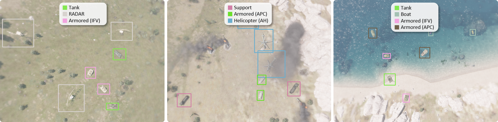

<div align="center">
    
</div>

<hr>

<h3 align="center">
🛠️ An Open-source Toolkit for Synthetic RGB-T Military Object Detection Data Generation
</h3>

<p align="center">
  <a href="#"></a>
  <a href="#"></a>
  <a href="#"></a>
  <a href="#"></a>
</p>

<hr>


### Preview
<p align="center">
    
</p>

### Updates
- (03/2026) Welcome!


### Quick start
- We assume that you have already finished setting up Arma 3 by our [tutorial]() in advance.
- Please install necessary python libraries in `requirements.txt`
  ~~~shell
  conda create -n g-mad python=3.8 -y
  conda activate g-mad
  pip install -r .\requirements.txt
  ~~~
- For example, run the below command to generate **10** scenes of **sunny** day which covers all camera tilt cases between **-60** and **60** degrees, from **9AM** to **6PM**, on the map named **malden** for **training**:
```bashshell
python main.py  -weather 'sunny' -map_name 'malden' \
                -arma_root_path 'C:/Users/{user_name}/Documents/Arma 3' \
                -save_root_path 'C:/Users/{user_name}/Desktop' \
                -start_hour 9 -end_hour 18 \
                -n_times 10 -mode 'EO' \
                -class_path 'classes/CLASSES.csv' \
                -invalid_bbox_path 'classes/INVALID_BBOX.csv' \ 
                -look_angle_min -60 -look_angle_max 60
```
- To create only on-nadir view scenes, set both `look_angle_min` and `look_angle_max` to 0.
- ⭐ Try to use our GUI tool: `python main_GUI.py` instead for convenience!


### Dataset structure
- The directory structure of our dataset is as follows:
~~~
|—— 📁 {train or test}_{map_name}_{weather}_{start_hour}_{end_hour}_...
	|—— 📁 0000 (scene number)
		|—— 📁 20  (look angle)
			|—— 🖼️ EO_0000_-0.png  
			|—— 📄 ANNOTATION-EO_0000_20.csv (including bbox labels)
		|—— 📁 +20 
			|—— 🖼️ ...
	|—— 📁 0001
		|—— 📁 -20
		|—— 📁 ... 
	|—— 📁 0002
		|—— 📁 -20
		|—— 📁 ...
	...
	|—— 📄 meta_..._.csv (including in-game shooting time, weather, and error logs per each scene)
~~~
- You may need to transform the above folder structure before training your own model.


### Citation
- Paper is coming soon!


### Contribution
- If you find any bugs for further improvements, please feel free to create issues on GitHub!
- All contributions and suggestions are welcome. Of course, stars (🌟) are always welcome.
